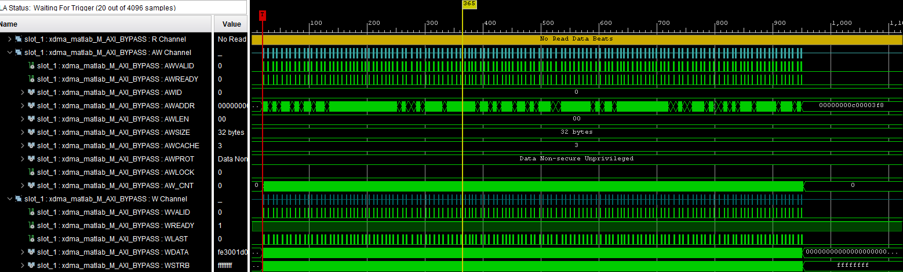
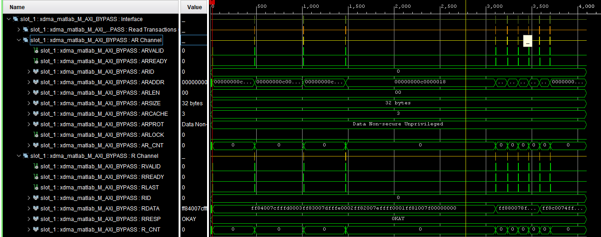

Host bypass BAR may be useful for small transfers that require low and stable latency.
However, exact detail may vary between CPU architectures and read and write operation.
For illustration here is transfer write and read of 1024 bytes on bypass BAR on x86-64 
arch.

Write operation is very fast, probably because it simply puts the data onto hardware 
trasfer queue and doesn't wait for the acknowledgement. This behaviour might be, however,
different on another architecture.

Read operation must, however, wait for the return of data from the FPGA, therefore has
much larger latency

Thus it is advisable to test, preferably monitored by ILA, whether it suits your
application.